# Визуальные диаграммы ConvertData (Mermaid)

> **Примечание:** Эти диаграммы в формате Mermaid можно просматривать напрямую на GitHub. Для локального просмотра используйте [Mermaid Live Editor](https://mermaid.live) или VS Code расширение [Mermaid Preview](https://marketplace.visualstudio.com/items?itemName=bierner.markdown-mermaid).

## 📊 Общий поток данных

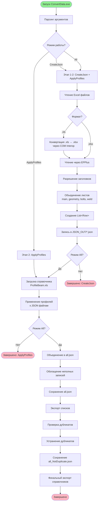

## 🏗️ Архитектура слоёв

```mermaid
flowchart LR
    subgraph Presentation
        Program[Program.cs<br/>Main Entry Point]
    end
    
    subgraph Application["Application Layer"]
        ConvertApp[ConvertApp<br/>Orchestrator]
        Enricher[JsonRecordEnricher]
        Dedup[ConnectionCodeDeduplicator]
        ProfileExporter[ProfileExcelToJsonExporter]
        ProfileLoader[ProfileLookupLoader]
        ProfilePatcher[JsonProfilePatcher]
    end
    
    subgraph Domain["Domain Layer"]
        Row[Row<br/>Main Entity]
        Bolts[CoordinatesBolts]
        ProfileGeom[ProfileGeometry]
    end
    
    subgraph Infrastructure["Infrastructure Layer"]
        Reader[EpplusRowReader]
        Writer[JsonRowWriter]
        Mapper[RowMapper]
        Parser[NumericParser]
        HeaderResolver[ExcelHeaderResolver]
    end
    
    subgraph External["External Dependencies"]
        EPPlus[EPPlus 7.x]
        JSON[System.Text.Json]
        COM[COM Interop Excel]
    end
    
    Program --> ConvertApp
    ConvertApp --> Enricher
    ConvertApp --> Dedup
    ConvertApp --> ProfileExporter
    ConvertApp --> ProfileLoader
    ConvertApp --> ProfilePatcher
    ConvertApp --> Reader
    ConvertApp --> Writer
    
    Reader --> Mapper
    Reader --> HeaderResolver
    Reader --> Parser
    Reader --> Row
    Reader --> Bolts
    
    Mapper --> Row
    Mapper --> Parser
    
    Writer --> Row
    
    ProfileLoader --> ProfileGeom
    
    Reader --> EPPlus
    Reader --> COM
    Enricher --> JSON
    Dedup --> JSON
    ProfilePatcher --> JSON
    
    style Program fill:#E1F5FE
    style ConvertApp fill:#B3E5FC
    style Row fill:#FFF9C4
    style Reader fill:#C8E6C9
    style EPPlus fill:#FFCCBC
```

## 🔄 Последовательность обогащения записей

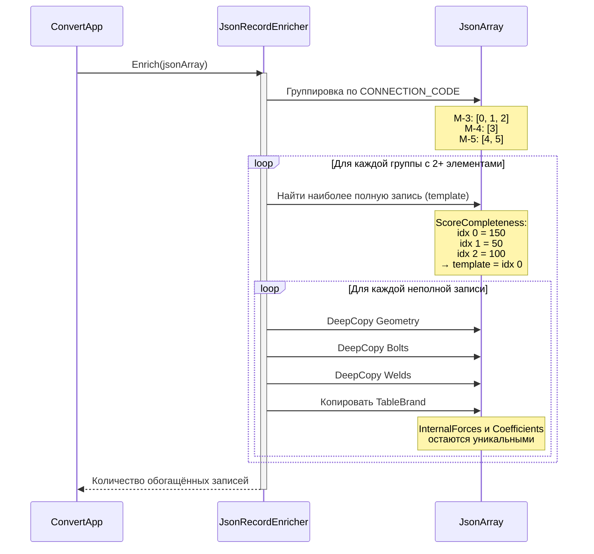

## 📦 Структура данных Row

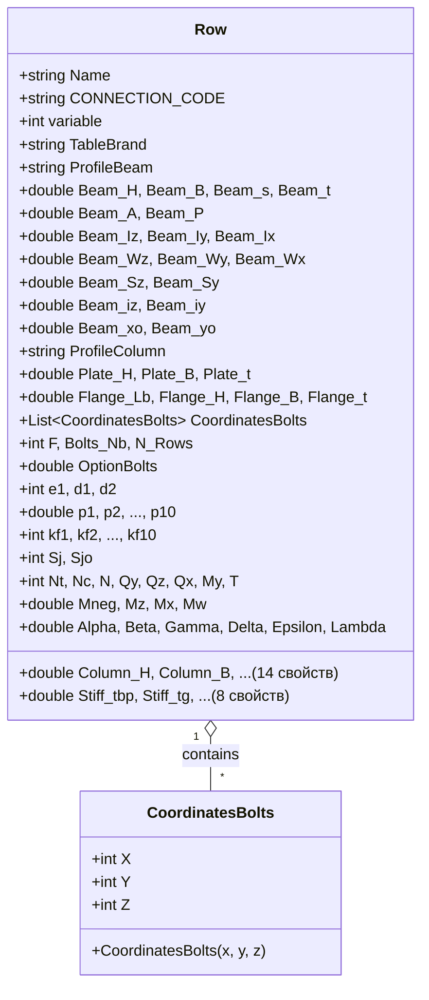

## 🗂️ Схема Excel → JSON маппинга

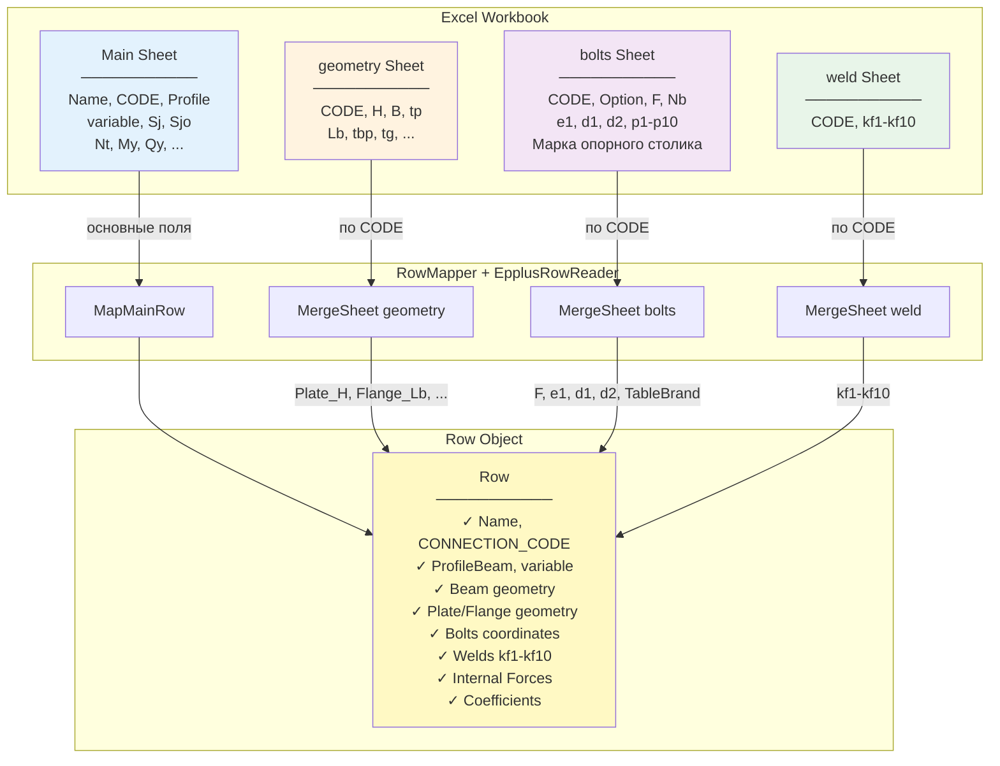

## 🔍 Процесс устранения дубликатов

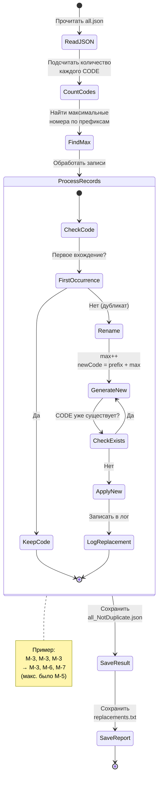

## 🌐 Граф зависимостей компонентов

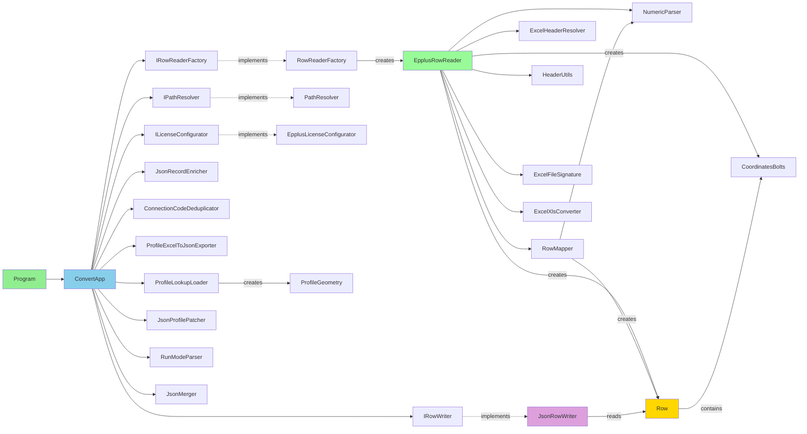

## 📈 Статистика обработки данных

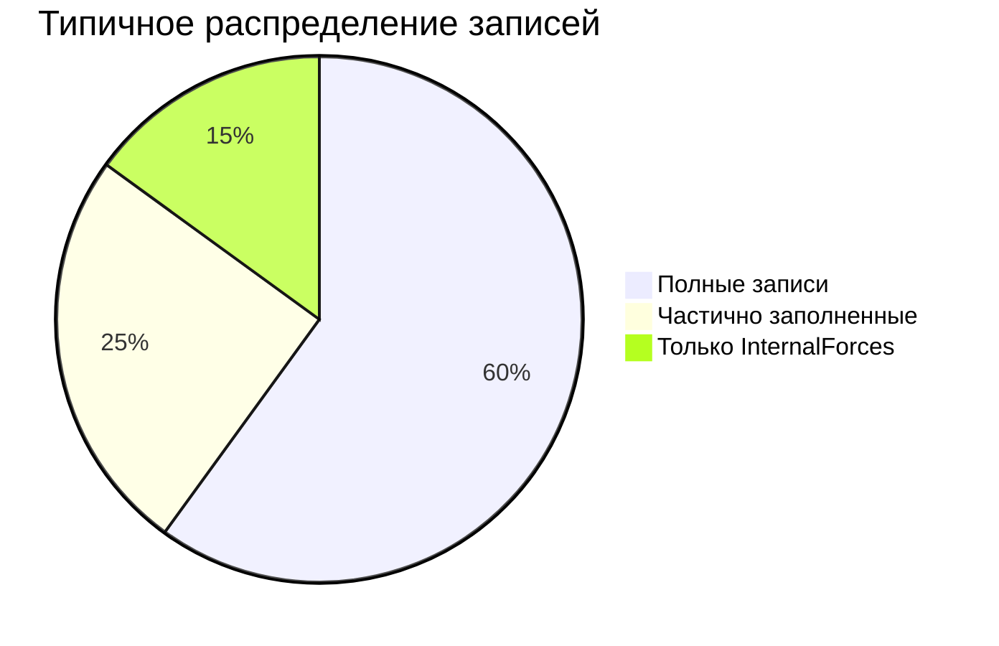

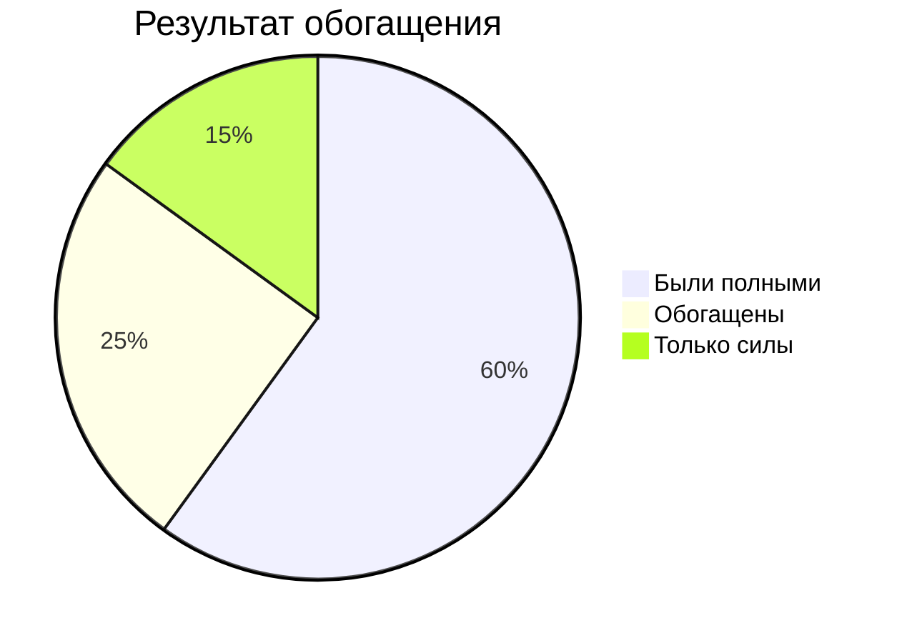

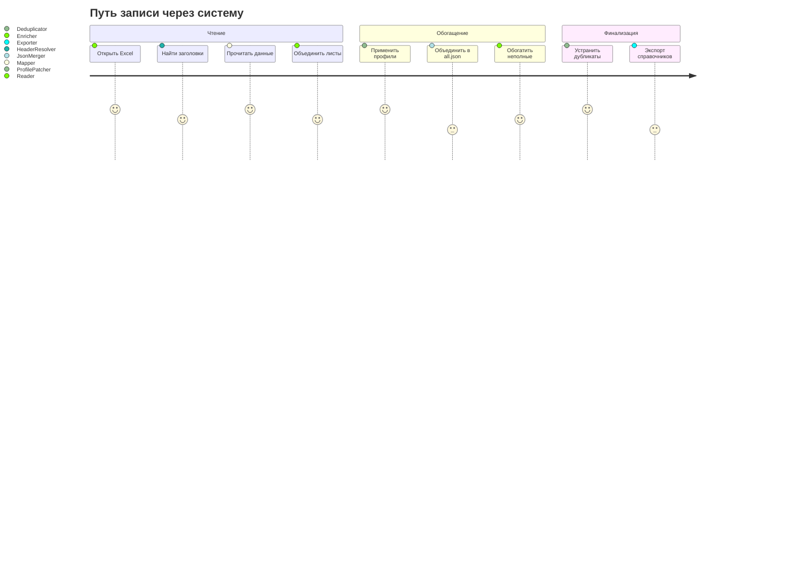

## 🔐 Обработка ошибок

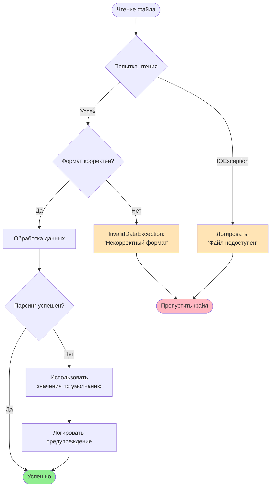

---

## 📝 Как использовать диаграммы

### GitHub
Диаграммы Mermaid автоматически рендерятся в README.md и других Markdown файлах на GitHub.

### VS Code
1. Установите расширение: **Markdown Preview Mermaid Support**
2. Откройте файл в режиме предпросмотра (Ctrl+Shift+V)

### Mermaid Live Editor
1. Откройте https://mermaid.live
2. Скопируйте код диаграммы
3. Вставьте в редактор
4. Экспортируйте как PNG/SVG

### CLI
```bash
npm install -g @mermaid-js/mermaid-cli
mmdc -i diagram.mmd -o diagram.png
```

---

**См. также:**
- [README](README.md)
- [Архитектура](Architecture.md)
- [Поток данных](DataFlow.md)
- [UML диаграммы](UML.md) — PlantUML версии
- [API документация](API.md)
