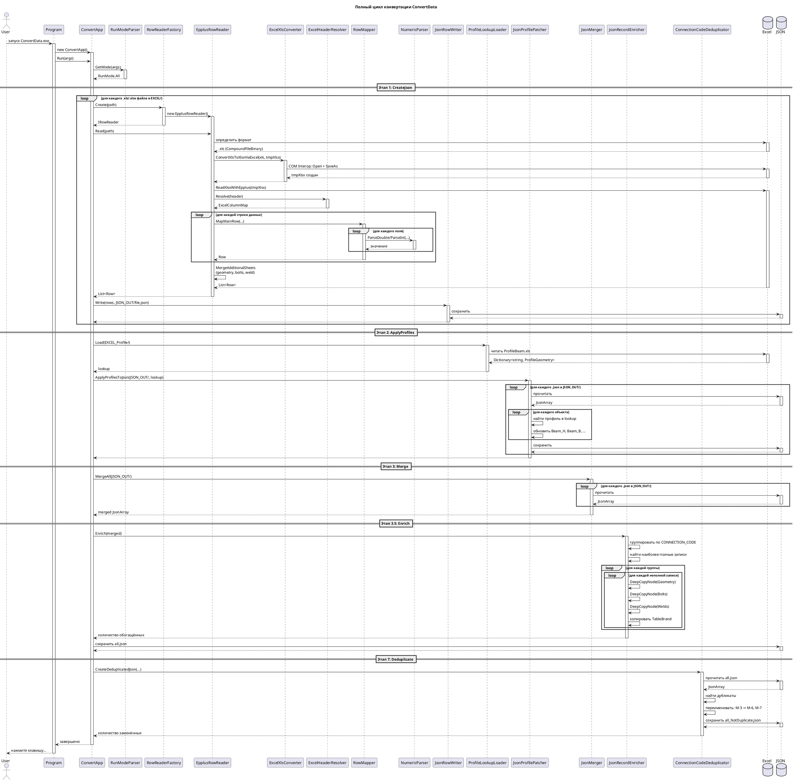
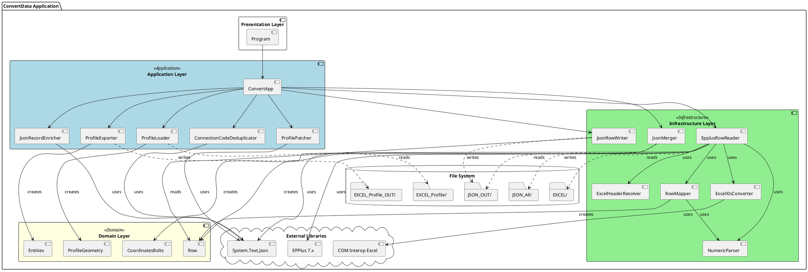
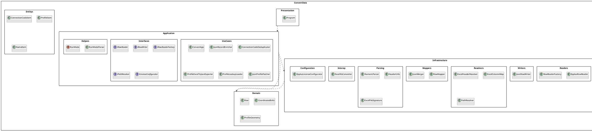
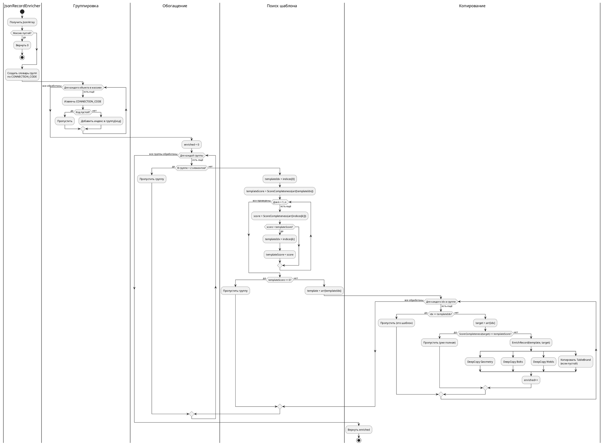
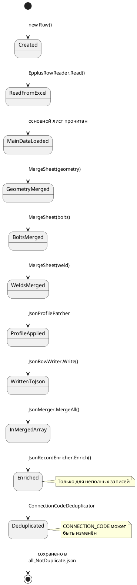
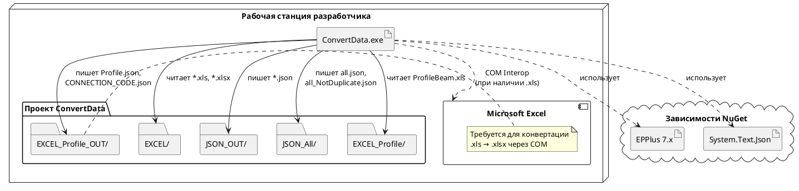
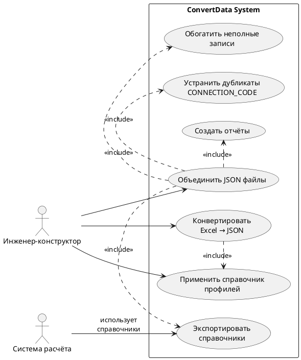
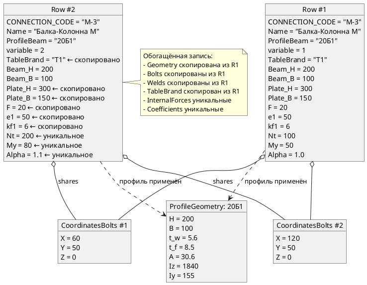

# UML Диаграммы ConvertData

## 📐 Диаграмма классов (Class Diagram)

### PlantUML код

```plantuml
@startuml ConvertData_ClassDiagram

' Стили
skinparam classAttributeIconSize 0
skinparam class {
    BackgroundColor<<Application>> LightBlue
    BackgroundColor<<Domain>> LightYellow
    BackgroundColor<<Infrastructure>> LightGreen
    BackgroundColor<<Entity>> LightCyan
}

' ========== Presentation Layer ==========
package "Presentation" {
    class Program {
        {static} +Main(args: string[]): void
    }
}

' ========== Application Layer ==========
package "Application" <<Application>> {
    class ConvertApp {
        -_writer: IRowWriter
        -_readerFactory: IRowReaderFactory
        -_pathResolver: IPathResolver
        -_licenseConfig: ILicenseConfigurator
        +Run(args: string[]): void
        -CreateJsonFromExcel(...): void
        -ApplyProfilesFromExcel(...): void
        -MergeAllAndExport(...): void
    }
    
    class JsonRecordEnricher {
        {static} -GeometrySubSections: string[]
        +Enrich(arr: JsonArray): int
        {static} -EnrichRecord(...): void
        {static} -DeepCopyNode(...): void
        {static} -ScoreCompleteness(...): int
        {static} -CountNonZeroValues(...): int
        {static} -GetNumericValue(...): double
    }
    
    class ConnectionCodeDeduplicator {
        +CreateDeduplicatedJson(...): int
        {static} -ExtractPrefix(...): string?
    }
    
    class ProfileExcelToJsonExporter {
        {static} -FileCategoryMap: Dictionary
        +Export(...): void
    }
    
    class ProfileLookupLoader {
        +Load(dir: string): Dictionary<string, ProfileGeometry>
    }
    
    class JsonProfilePatcher {
        +ApplyProfilesToJson(...): void
    }
    
    class RunModeParser {
        {static} +GetMode(args: string[]): RunMode
        {static} +GetInputArgsForCreateJson(...): string[]
        {static} +GetProfileColumn(...): string?
    }
    
    enum RunMode {
        All
        CreateJson
        ApplyProfiles
    }
    
    interface IRowReader {
        +Read(path: string): List<Row>
    }
    
    interface IRowWriter {
        +Write(rows: List<Row>, outputPath: string): void
    }
    
    interface IRowReaderFactory {
        +Create(path: string): IRowReader
    }
    
    interface IPathResolver {
        +GetProjectDir(startDir: string): string?
    }
    
    interface ILicenseConfigurator {
        +Configure(): void
    }
}

' ========== Domain Layer ==========
package "Domain" <<Domain>> {
    class Row {
        +Name: string
        +CONNECTION_CODE: string
        +variable: int
        +TableBrand: string
        
        +ProfileBeam: string
        +Beam_H: double
        +Beam_B: double
        +Beam_s: double
        +Beam_t: double
        +Beam_A: double
        +Beam_P: double
        +Beam_Iz: double
        +Beam_Iy: double
        +Beam_Ix: double
        +Beam_Wz: double
        +Beam_Wy: double
        +Beam_Wx: double
        +Beam_Sz: double
        +Beam_Sy: double
        +Beam_iz: double
        +Beam_iy: double
        +Beam_xo: double
        +Beam_yo: double
        
        +ProfileColumn: string
        +Column_H: double
        ' ... (аналогично для Column)
        
        +Plate_H: double
        +Plate_B: double
        +Plate_t: double
        
        +Flange_Lb: double
        +Flange_H: double
        +Flange_B: double
        +Flange_t: double
        
        +Stiff_tbp: double
        ' ... (остальные Stiff)
        
        +CoordinatesBolts: List<CoordinatesBolts>
        +F: int
        +Bolts_Nb: int
        +N_Rows: int
        +OptionBolts: double
        +e1: int
        +d1: int
        +d2: int
        +p1..p10: double
        
        +kf1..kf10: int
        
        +Sj: int
        +Sjo: int
        
        +Nt: int
        +Nc: int
        +N: int
        +Qy: int
        +Qz: int
        +Qx: int
        +My: int
        +T: int
        +Mneg: double
        +Mz: double
        +Mx: double
        +Mw: double
        
        +Alpha: double
        +Beta: double
        +Gamma: double
        +Delta: double
        +Epsilon: double
        +Lambda: double
    }
    
    class CoordinatesBolts {
        +X: int
        +Y: int
        +Z: int
        +CoordinatesBolts(x: int, y: int, z: int)
    }
    
    class ProfileGeometry <<record>> {
        +H: double
        +B: double
        +t_w: double
        +t_f: double
        +r1: double
        +r2: double
        +A: double
        +P: double
        +Iz: double
        +Iy: double
        +Ix: double
        +Wz: double
        +Wy: double
        +Wx: double
        +Sz: double
        +Sy: double
        +iz: double
        +iy: double
        +iu: double
        +xo: double
        +yo: double
    }
}

' ========== Infrastructure Layer ==========
package "Infrastructure" <<Infrastructure>> {
    class EpplusRowReader {
        +Read(path: string): List<Row>
        {static} -ReadXlsxWithEpplus(...): List<Row>
        {static} -GetCell(...): string
        {static} -FindHeaderRow(...): int
        {static} -MergeAdditionalSheets(...): void
        {static} -MergeSheet(...): void
        {static} -EnsureBolts(...): void
        {static} -BuildBoltsColumnMap(): Dictionary
    }
    
    class JsonRowWriter {
        {static} -BoltYKeys: string[]
        {static} -BoltXKeys: string[]
        +Write(...): void
        {static} -WriteBeam(...): void
        {static} -WriteColumn(...): void
        {static} -WritePlate(...): void
        {static} -WriteFlange(...): void
        {static} -WriteStiff(...): void
        {static} -WriteBolts(...): void
        {static} -WriteBoltY(...): void
        {static} -WriteBoltX(...): void
        {static} -WriteBoltZ(...): void
        {static} -WriteWelds(...): void
        {static} -WriteInternalForces(...): void
        {static} -Dbl(v: double): string
        {static} -JsonEscape(s: string): string
    }
    
    class RowReaderFactory {
        +Create(path: string): IRowReader
    }
    
    class PathResolver {
        +GetProjectDir(startDir: string): string?
        {static} +HasExcelExtension(path: string): bool
    }
    
    class EpplusLicenseConfigurator {
        +Configure(): void
    }
    
    class ExcelColumnMap {
        +IdxH: int
        +IdxB: int
        +Idxs: int
        +Idxt: int
        +IdxName: int
        +IdxCode: int
        +IdxProfile: int
        ' ... (все остальные индексы)
        +IdxAlpha..IdxLambda: int
        +IsMainTable: bool <<get>>
        +IsProfileTable: bool <<get>>
    }
    
    class ExcelHeaderResolver {
        {static} +ProfileColumnOverride: string?
        {static} +Resolve(header: List<string>): ExcelColumnMap
        {static} -ResolveGreekFallback(...): void
        {static} +ApplyProfileFallback(...): void
    }
    
    class RowMapper {
        {static} +MapMainRow(...): Row
        {static} +MapProfileRow(...): Row
    }
    
    class JsonMerger {
        +MergeAll(jsonDir: string): JsonArray
    }
    
    package "Parsing" {
        class NumericParser {
            {static} -RuCulture: CultureInfo
            {static} +ParseDouble(s: string?): double
            {static} +ParseInt(s: string?): int
        }
        
        class HeaderUtils {
            {static} +NormalizeHeader(h: string): string
            {static} +IndexOfHeader(...): int
            {static} +IndexOfHeaderAny(...): int
        }
        
        enum ExcelFileFormat {
            Unknown
            ZipXlsx
            CompoundFileBinary
        }
        
        class ExcelFileSignature {
            {static} +Detect(path: string): ExcelFileFormat
        }
    }
    
    package "Interop" {
        class ExcelXlsConverter {
            {static} +ConvertXlsToXlsxViaExcel(...): void
        }
    }
}

' ========== Entities ==========
package "Entitys" <<Entity>> {
    class ConnectionCodeItem {
        +CONNECTION_GUID: Guid
        +CONNECTION_CODE: string
    }
    
    class ProfileItem {
        +CONNECTION_GUID: Guid
        +Profile: string
    }
    
    class NameItem {
        +NAME_GUID: Guid
        +Name: string
    }
}

' ========== Relationships ==========

' Program → ConvertApp
Program ..> ConvertApp : creates

' ConvertApp dependencies
ConvertApp --> IRowWriter : uses
ConvertApp --> IRowReaderFactory : uses
ConvertApp --> IPathResolver : uses
ConvertApp --> ILicenseConfigurator : uses
ConvertApp ..> JsonRecordEnricher : uses
ConvertApp ..> ConnectionCodeDeduplicator : uses
ConvertApp ..> ProfileExcelToJsonExporter : uses
ConvertApp ..> ProfileLookupLoader : uses
ConvertApp ..> JsonProfilePatcher : uses
ConvertApp ..> RunModeParser : uses
ConvertApp ..> JsonMerger : uses

' Interface implementations
EpplusRowReader ..|> IRowReader
JsonRowWriter ..|> IRowWriter
RowReaderFactory ..|> IRowReaderFactory
PathResolver ..|> IPathResolver
EpplusLicenseConfigurator ..|> ILicenseConfigurator

' RowReaderFactory → EpplusRowReader
RowReaderFactory ..> EpplusRowReader : creates

' EpplusRowReader dependencies
EpplusRowReader --> ExcelHeaderResolver : uses
EpplusRowReader --> RowMapper : uses
EpplusRowReader --> NumericParser : uses
EpplusRowReader --> HeaderUtils : uses
EpplusRowReader --> ExcelFileSignature : uses
EpplusRowReader --> ExcelXlsConverter : uses
EpplusRowReader --> CoordinatesBolts : creates
EpplusRowReader --> Row : creates

' RowMapper → NumericParser
RowMapper --> NumericParser : uses
RowMapper --> Row : creates

' JsonRowWriter → Row
JsonRowWriter --> Row : reads

' ProfileLookupLoader → ProfileGeometry
ProfileLookupLoader --> ProfileGeometry : creates

' Row → CoordinatesBolts
Row "1" o-- "*" CoordinatesBolts : contains

@enduml
```



### Визуализация

Для рендеринга этой диаграммы используйте:
- [PlantUML Online Editor](https://www.plantuml.com/plantuml/uml/)
- VS Code расширение "PlantUML"
- IntelliJ IDEA PlantUML integration

---

## 📊 Диаграмма последовательности (Sequence Diagram)

### Сценарий: Полный цикл конвертации



---

## 🏛️ Компонентная диаграмма (Component Diagram)



---

## 📦 Диаграмма пакетов (Package Diagram)



---

## 🔄 Диаграмма активности (Activity Diagram)

### Процесс обогащения записей



---

## 📈 Диаграмма состояний (State Diagram)

### Жизненный цикл Row



---

## 🗺️ Диаграмма развертывания (Deployment Diagram)



---

## 🔍 Диаграмма вариантов использования (Use Case Diagram)



---

## 📋 Диаграмма объектов (Object Diagram)

### Пример структуры данных после обогащения



---

## 🛠️ Как использовать диаграммы

### Рендеринг PlantUML

1. **Online:**
   - [PlantUML Web Server](https://www.plantuml.com/plantuml/uml/)
   - Скопируйте код диаграммы и вставьте в редактор

2. **VS Code:**
   ```bash
   # Установить расширение
   ext install jebbs.plantuml
   
   # Установить PlantUML локально (требуется Java)
   # или использовать онлайн сервер
   ```

3. **IntelliJ IDEA:**
   - Встроенная поддержка PlantUML
   - Settings → Plugins → PlantUML Integration

4. **Командная строка:**
   ```bash
   java -jar plantuml.jar diagram.puml
   # Создаст diagram.png
   ```

### Экспорт изображений

PlantUML поддерживает несколько форматов:
- PNG (по умолчанию)
- SVG (векторный, масштабируемый)
- EPS (для публикаций)
- PDF (для документации)

```bash
java -jar plantuml.jar -tsvg UML.puml
```

---

**См. также:**
- [README](README.md)
- [Архитектура](Architecture.md)
- [Поток данных](DataFlow.md)
